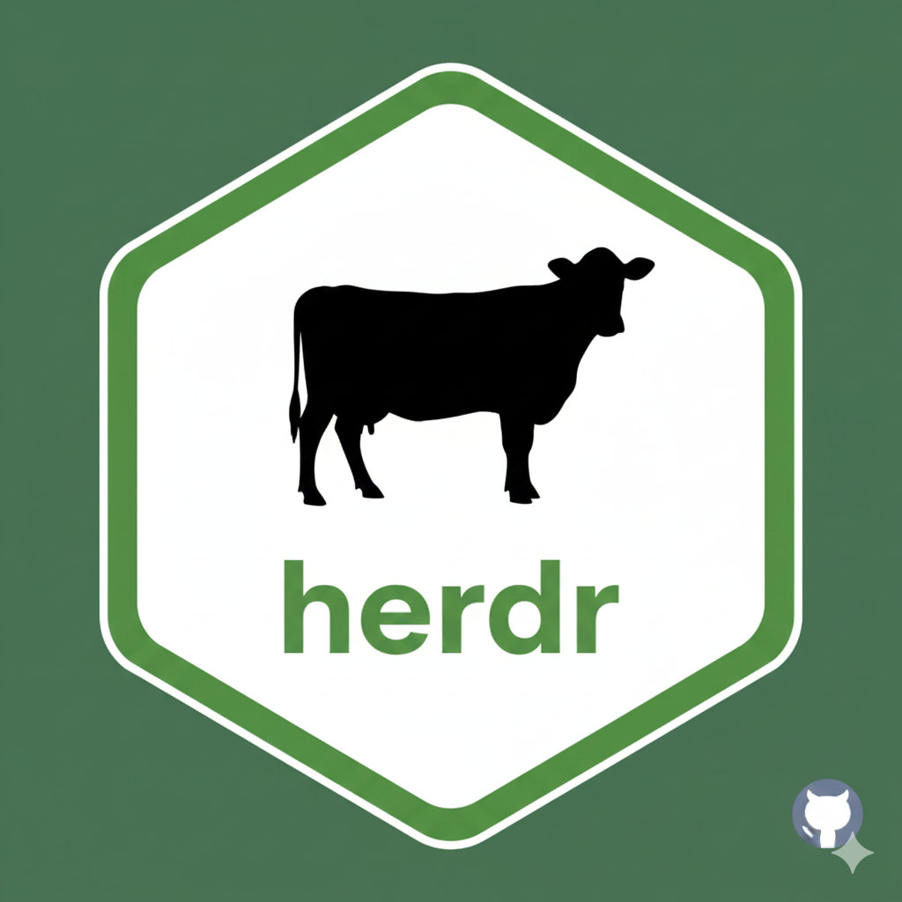

# herdr 

[](https://www.repostatus.org/#active)
[](https://github.com/JuanCBM99/herdr/actions/workflows/build.yaml)
[](https://github.com/JuanCBM99/herdr/actions/workflows/docs.yaml)
[](https://codecov.io/gh/JuanCBM99/herdr)
[](https://github.com/JuanCBM99/herdr/actions/workflows/test-coverage.yaml)
[](https://www.youtube.com/watch?v=wmGIQ3g-ZFk&t=29s)
[](https://www.r-project.org/)
---

# 🌟 herdr: GHG & LU Calculator 

An R package to calculate Greenhouse Gas emissions (CH₄, N₂O) and Land Use (LU) in livestock systems, based on the IPCC Tier 2 methodology.

---

## 📺 Video Tutorial: Get Started in 5 Minutes

If you prefer a visual guide, watch this official tutorial covering installation, data setup, and running your first assessment.

[](https://www.youtube.com/watch?v=ID_DE_TU_VIDEO)

---

## 🖥️ Prerequisites: Installing R and RStudio

If you do not have R and RStudio installed, follow these steps:

### 1. Install R

1. Go to the [R Project website](https://www.r-project.org/) and download the latest version for your operating system (Windows, macOS, Linux).  
2. Run the installer and follow the on-screen instructions.

### 2. Install RStudio

1. Go to the [RStudio website](https://www.rstudio.com/products/rstudio/download/) and download the free RStudio Desktop version.  
2. Install RStudio using the downloaded installer.

---

## 🚀 Quick start

herdr is a development package and can be installed directly from GitHub using `remotes`:

```r
# Install (if needed)
if (!requireNamespace("remotes", quietly = TRUE)) install.packages("remotes")
remotes::install_github("JuanCBM99/herdr")

library(herdr)

# Initialize project (creates user_data folder)
herdr_init()

# Copy example CSVs to user_data/ (overwrite existing)
file.copy(list.files("Examples/Level1_Spain_Dairy_Cattle_2015", full.names = TRUE), "user_data")

# Run a full impact assessment
results <- generate_impact_assessment()
results
```

---

This runs a full cattle system example, generating CH₄, N₂O, and Land Use outputs.

## ✨✨ Key Features

IPCC Tier 2 Methodology: Robust calculations for enteric emissions, manure management, and indirect N₂O emissions.

Land Use Assessment: Integrated calculation of land requirements (m²/year) associated with different livestock management systems and based on economic allocation.

Nutritional Precision: Integrated Dry Matter Intake (DMI) estimation and nutritional alerts for Cattle, Sheep, and Goats.

Modular and Flexible: Allows detailed input of population census, diet profiles, and management systems at the farm or subregion level.

Consolidated Output: Generates a single report summarizing impacts (CH₄, N₂O, and LU).

---

## 📚 Documentation & Reference

[Package Documentation Website]: Includes workflow guides, some comprehensive examples and the theoretical basis (IPCC Tier 2).

Website URL: https://juancbm99.github.io/herdr/

## 🤝 Contributions

Contributions are welcome! If you find a bug or have suggestions for improvement, please open an issue or submit a pull request.

