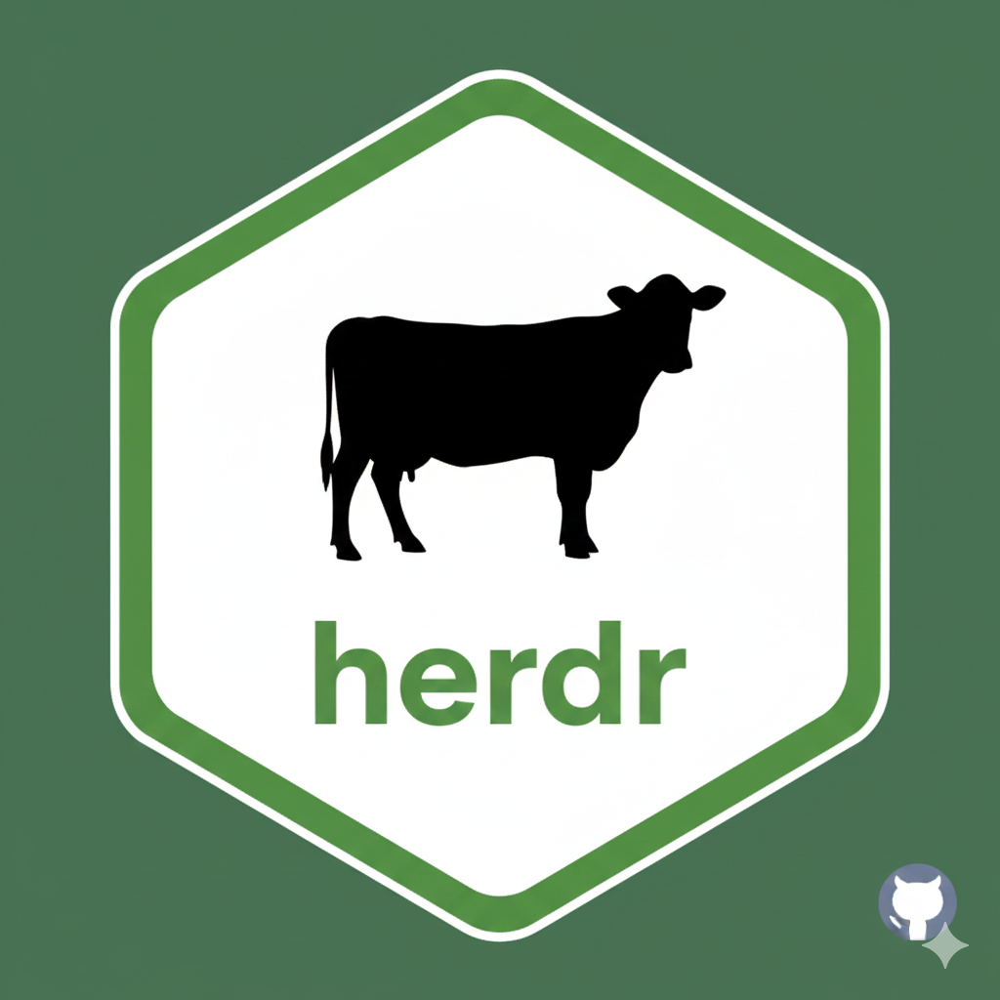

------------------------------------------------------------------------

# herdr 

[](https://www.repostatus.org/#active) [](https://github.com/JuanCBM99/herdr/actions/workflows/build.yaml) [](https://github.com/JuanCBM99/herdr/actions/workflows/docs.yaml) [](https://codecov.io/gh/JuanCBM99/herdr) [](https://github.com/JuanCBM99/herdr/actions/workflows/test-coverage.yaml) [](https://www.youtube.com/watch?v=wmGIQ3g-ZFk) [](https://www.r-project.org/)

------------------------------------------------------------------------

# 🌱 herdr: Greenhouse Gas Emissions & Land Use Assessment for Livestock

**herdr** is an R package for estimating **greenhouse gas (GHG) emissions**, **feed-related land use**, and **livestock production** from livestock farming systems using **IPCC Tier 2** methodologies.

The package supports 5 major livestock species:

- 🐄 **Cattle** (dairy and beef)
- 🐑 **Sheep** (dairy and meat)
- 🐐 **Goats** (dairy and meat)
- 🐖 **Swine** (breeding sows, boars, piglets, and fattening pigs)
- 🐔 **Poultry** (broilers, laying hens, and breeding flocks)

It provides comprehensive estimates of:

- 🌿 **Enteric methane (CH₄)**
- ♻️ **Manure methane (CH₄)**
- 🌱 **Direct and indirect nitrous oxide emissions (N₂O)**
- 🌾 **Feed-related land use (m²)**
- 🥩 **Livestock production outputs** (meat liveweight, carcass weight, milk, and eggs)

------------------------------------------------------------------------

# 🌐 Web Interface (No R or installation required!)

You don't need programming experience or R installed to use **herdr**. A fully interactive web application allows users to build herds, configure diets, estimate emissions and land use, and export publication-ready results directly from a web browser.

👉 **Launch the herdr Web Application:**  
[**https://juancbm99.shinyapps.io/herdr/**](https://juancbm99.shinyapps.io/herdr/)

> **Note:** The web application performs all calculations in the cloud and does not require local downloads or setup.

------------------------------------------------------------------------

# 📺 Video Tutorial

A complete video walkthrough covering installation, project setup, input files, and running your first assessment is available on YouTube:

👉 [**Watch the herdr Video Tutorial**](https://youtu.be/wmGIQ3g-ZFk)

------------------------------------------------------------------------

# 💻 Installation & Quick Start

## Installation

Install the development version directly from GitHub:

```r
if (!requireNamespace("remotes", quietly = TRUE))
  install.packages("remotes")

remotes::install_github("JuanCBM99/herdr")

library(herdr)
```

## Option A: Interactive Web App (GUI)

Launch the interactive graphical interface locally from R:

```r
run_herdr_app()
```

## Option B: Command Line (R Script)

Run a complete assessment in two simple commands:

```r
library(herdr)

# 1. Initialize project (creates 'user_data/' pre-populated with a default template)
herdr_init()

# 2. Run the impact assessment
results <- generate_impact_assessment(
  farm_country = "Spain",
  year = "2024"
)

results
```

> **Important:** The first time an assessment requires feed origin allocation, **herdr** automatically downloads the FAO background trade matrix (~187 MB). This download occurs only once and is cached locally for all future runs.
>
> 💡 **Tip:** To explore more complex farming systems (e.g. multi-region herds, seasonal rations, or physiological phases), browse the bundled `Examples/` folder created by `herdr_init()` and copy any template into `user_data/`.

All output CSV files and plots are automatically saved in the `output/` directory.

------------------------------------------------------------------------

# ✨ Main Features

- 🌐 **Interactive GUI:** Full-featured Shiny interface with in-app data dictionary, tooltips, validation alerts, and interactive tables.
- 📖 **IPCC 2019 Refinement (Tier 2):** Complete equations for gross energy, dry matter intake, volatile solids, and nitrogen mass balances.
- 🐄 **Ruminant & Monogastric Support:** Tailored models for cattle, sheep, goats, swine, and poultry.
- 🐖 **FEDNA Nutritional Standards:** Energy requirement equations for swine and poultry based on official Spanish FEDNA guidelines.
- 🔄 **Automated Herd Demography:** Built-in biological engine (`automatic_cycle = TRUE`) calculating births, replacement rates, and standing barn places (IPCC Average Annual Population) from breeding stock.
- 🌾 **High-Resolution Land Use:** Feed footprint calculation combining FAOSTAT yields, official national forage statistics (e.g. MAPA 2024), and an international trade matrix with a 70% domestic self-sufficiency rule.
- 🥩 **Production Accounting:** Calculates annual meat liveweight, carcass weight, milk yield, and egg production.
- 🧩 **Modular Architecture:** Run the entire pipeline with one function or call individual calculation modules independently.
- 📄 **Transparent CSV Inputs:** Intuitive spreadsheet templates that work seamlessly with Excel, LibreOffice, or text editors.

------------------------------------------------------------------------

# 📚 Documentation & Guides

Comprehensive documentation, theoretical background, and step-by-step guides are hosted on the [**herdr Documentation Website**](https://juancbm99.github.io/herdr/):

| Guide | Description |
|:---|:---|
| [**Introduction to herdr**](https://juancbm99.github.io/herdr/articles/Introduction.html) | High-level package overview, scope, and core philosophy. |
| [**R Workflow Guide**](https://juancbm99.github.io/herdr/articles/Workflow.html) | Detailed walkthrough of input files, table relations, and execution. |
| [**Web Application Guide**](https://juancbm99.github.io/herdr/articles/app.html) | Step-by-step manual for the interactive Shiny app. |
| [**Herd Demography & Population Dynamics**](https://juancbm99.github.io/herdr/articles/Herd_Demography.html) | How biological cycles, reproduction, replacements, and fattening batches work. |
| [**Land Use & Trade Matrix**](https://juancbm99.github.io/herdr/articles/land_use.html) | Methodology for feed-related land use, trade tracing, and crop/forage yields. |
| [**Theoretical Basis (IPCC Tier 2)**](https://juancbm99.github.io/herdr/articles/Theoretical_basis.html) | Full mathematical formulations for enteric methane, manure, and nitrogen excretion. |
| [**Technical File Reference**](https://juancbm99.github.io/herdr/articles/Technical_reference.html) | Column-by-column dictionary for all CSV user inputs and internal databases. |
| [**Tutorial Examples**](https://juancbm99.github.io/herdr/articles/Easy_Example.html) | Practical case studies across [Easy (Tier 1)](https://juancbm99.github.io/herdr/articles/Easy_Example.html), [Moderate (Tier 2)](https://juancbm99.github.io/herdr/articles/Moderate_Example.html), and [Difficult (Tier 3)](https://juancbm99.github.io/herdr/articles/Difficult_Example.html) complexities. |

------------------------------------------------------------------------

# 📖 Methodology & References

**herdr** is built upon internationally recognized guidelines:

* **IPCC (2019):** *2019 Refinement to the 2006 IPCC Guidelines for National Greenhouse Gas Inventories*, Volume 4 (AFOLU), Chapter 10 (*Emissions from Livestock and Manure Management*).
* **FEDNA (2019):** Energy and nutritional requirement systems for monogastric livestock (swine and poultry) published by the Spanish Ministry of Agriculture, Fisheries and Food (MAPA) and the Fundación Española para el Desarrollo de la Nutrición Animal.

------------------------------------------------------------------------

# 🤝 Contributing

Contributions, feedback, and issue reports are very welcome! If you encounter a bug, have questions about the methodology, or wish to suggest new features, please [open an issue](https://github.com/JuanCBM99/herdr/issues) or submit a pull request.

------------------------------------------------------------------------

# 📄 License

This project is open-source software licensed under the [**MIT License**](LICENSE).
