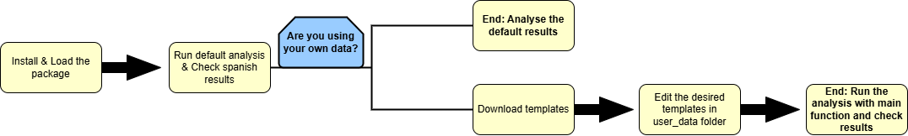

# Workflow Guide: Step-by-Step

## Workflow Guide: Step-by-Step

This guide explains the workflow for using the `herdr` model, from
exploring the default reference datasets to introducing and analysing
your own Tier 2 custom scenarios.



------------------------------------------------------------------------

### 1. Preliminary Analysis: Default National Data

**herdr** includes default datasets based on national averages and
emission factors for **Spain**. These allow you to run the model
immediately and obtain a **baseline environmental footprint**.

#### Step 1: Run a Quick Analysis

To view the results computed from the internal reference data, simply
load the package and run the main function
[`generate_impact_assessment()`](../reference/generate_impact_assessment.md).

``` r
# Load the package
library(herdr)

# Run the complete calculation using only internal package data
reporte_base <- generate_impact_assessment(
  group_by_identification = FALSE
)

# Display key impact columns
head(reporte_base)
```

#### 📊 Understanding the Output

The table returned by generate_impact_assessment() contains consolidated
results for emissions and land use.

| Column                  | Description                            | Unit        |
|-------------------------|----------------------------------------|-------------|
| `Emissions_CH4_enteric` | Methane from enteric fermentation      | kg CH₄/year |
| `Emissions_CH4_manure`  | Methane from manure management         | kg CH₄/year |
| `Emissions_N2O_direct`  | Direct nitrous oxide from manure       | kg N₂O/year |
| `Land_use_m2`           | Land area required for feed production | m²/year     |

### II. Customisation: Using Your Own Data (Tier 2)

For specific systems or Tier 2 calculations, you can edit the input data
to reflect your real case study.

#### 📥 Step 2: Download the Templates

Use download_templates() to generate the folder structure and obtain the
editable CSV files.

``` r
# This function creates the folder 'user_data/' in your working directory
download_templates()
```

#### 📝 Step 3: Edit the Key Input Files

The model automatically reads any CSV files inside user_data/.

| File                           | What to Modify                                                       | Importance       |
|--------------------------------|----------------------------------------------------------------------|------------------|
| `census.csv`                   | Animal population per `group` and `zone`.                            | High             |
| `categories.csv`               | Performance (milk yield, body weight, grazing) and `diet_tag`.       | High             |
| `diet.csv` / `ingredients.csv` | Diet composition (forage/concentrate, digestibility).                | Medium/High      |
| `coefficients.csv`, etc.       | Scientific/IPCC factors. Modify only if local studies are available. | Low/Experts only |

### III. Running Custom Scenario Analysis

Once you save your edited files into user_data/, the model will
automatically use them in the next run.

#### ⚙️ Step 4: Run the Model with Your Own Data

``` r
# Run the model using the customised data inside /user_data
resultados_personalizados <- generate_impact_assessment(
  saveoutput = TRUE,
  group_by_identification = TRUE
)

# Example: filter results by zone (if census.csv includes zones)
resultados_zona_A <- generate_impact_assessment(zone = "Zone_A")
```
