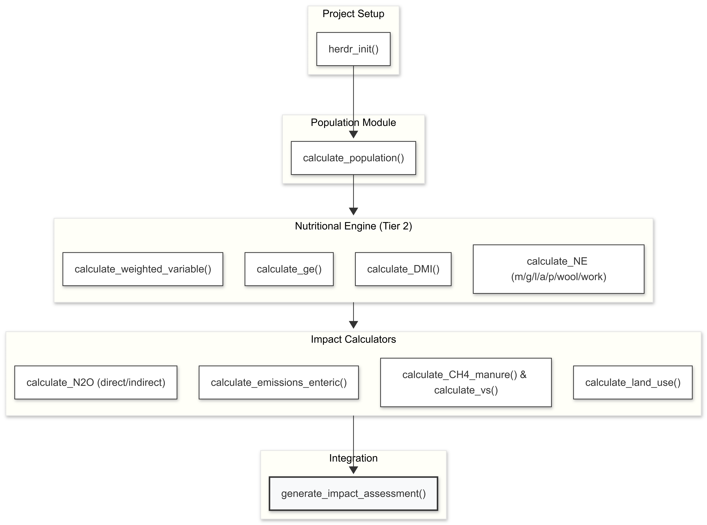

# Summary

Agri-food systems are known to be essential for human well-being, economies and environment. While these systems are necessary for global food security, they are also responsible for a significant share of global greenhouse gas (GHG) emissions and land use. In this context, the livestock sector is a major contributor to GHG emissions and land use change, making it crucial to understand and mitigate its environmental impacts.

To address this challenge, we present herdr, an R package designed to calculate emissions,land use, and additional environmental impacts in livestock systems based on the guidelines provided by the Intergovernmental Panel on Climate Change (IPCC) [@IPCC2019]. The herdr package offers a comprehensive set of tools for estimating these environmental burdens associated with livestock production, allowing researchers, policymakers, and practitioners to assess different livestock systems and identify opportunities for mitigation. By providing a user-friendly interface and robust calculations based on IPCC guidelines, herdr aims to facilitate the assessment of livestock-related emissions and land use, ultimately contributing to more sustainable agricultural practices and informed decision-making in the context of climate change mitigation.


The herdr package is hosted on GitHub ([https://github.com/JuanCBM99/herdr](#0){.uri}) under the MIT open-source license. Documentation, including detailed vignettes that demonstrate the package's core methodology and application to livestock data, is available at [https://JuanCBM99.github.io/herdr/](#0){.uri}. Also a quick video explaining how it works is public [here](https://www.youtube.com/watch?v=wmGIQ3g-ZFk). A basic how to run the package is provided below.

``` r
# Install
if (!requireNamespace("remotes", quietly = TRUE)) {
  install.packages("remotes")
}
remotes::install_github("JuanCBM99/herdr")

library(herdr)

# Initialize project
herdr_init()

# Load example data
file.copy(list.files("Examples/Level1_Spain_Dairy_Cattle_2015", full.names = TRUE), "user_data")

# Run model
results <- generate_impact_assessment(crop_yield_country = "Spain")
```

# Statement of need

The quantification of environmental impacts from livestock systems is a critical component of climate policy, as the sector contributes approximately 12% of global anthropogenic greenhouse gas (GHG) emissions [@FAO2023Pathways]. While the IPCC provides rigorous Tier 2 methodologies, in practice, their application often relies on fragmented spreadsheets or "black-box" calculators that lack the transparency and flexibility required for reproducible science. Recent evaluations confirm that current Decision Support Systems (DSS) in the livestock sector suffer from a lack of automation and limited integration, which hinders their wider adoption in research and policy [@Alexandropoulos2023Decision].

herdr fills this gap through a transparent, R-native framework tailored to environmental scientists, agronomists, and Life Cycle Assessment (LCA) practitioners. The software automates the conversion of raw zootechnical data—such as detailed feed composition, animal productivity and manure management information—into Tier 2 emission factors that ultimately can be translated into broader environmental indicators, such as land use or nutrient use efficiency. A clear separation between data input and computational logic makes it easier to integrate assessments into broader data science workflows. This design aligns with the FAIR principles (Findable, Accessible, Interoperable, and Reusable), recently adopted by the IPCC to promote open scrutiny and continued development of climate-related code [@Iturbide2022Implementation].

# State of the field

A variety of software tools currently exist to quantify environmental impacts from livestock systems across different geographical and operational scales. At the macro scale, the FAO's GLEAM framework—and its recent open-source R implementation, GLEAM-X—is widely recognized as the standard approach for regional and global estimations [@MacLeod2017Invited]. Conversely, at the farm scale, commercial tools such as the Cool Farm Tool and AgRE-Calc provide accessible interfaces tailored to individual agricultural systems. However, existing options often create a strict dichotomy between rigid top-down macro-modeling and closed, non-programmatic farm-level calculators.

`herdr` bridges this gap as a highly flexible, bottom-up modeling framework implementing the IPCC 2019 Refinement methodologies [@IPCC2019]. Unlike existing tools, it is applicable across multiple scales and avoids rigid, predefined regional baselines. This architecture allows users to scale assessments dynamically—from single-farm interventions to large-scale macro-inventories—by operating directly on user-defined parameters such as animal weight, productivity performance, and manure management. In contrast to high-level frameworks, herdr provides a modular and transparent implementation that allows users to work seamlessly across these different levels of geographic and biological detail.

A core feature of this flexibility is `herdr`'s user-driven nutritional approach. Users can construct highly customized diets using an extensive, built-in feed ingredient database explicitly developed for this framework, or extend it dynamically with custom resources. This allows for the precise representation of diverse feeding practices, including region-specific systems and non-standard feed scenarios, which can be translated into related environmental indicators such as land use and nutrient use efficiency. By separating input data from computational logic, `herdr` delivers a reproducible and extensible architecture compatible with modern data science workflows, echoing open-source initiatives in broader agricultural domains like MAgPIE 4 [@Dietrich2019MAgPIE].

# Software design

The architecture of `herdr` follows a **functional and modular pipeline** design in R, optimized for the nature of IPCC Tier 2 calculations. Instead of a rigid structure, the software is decomposed into specialized modules that handle specific physiological and environmental dimensions:

- **Modular Chain of Dependencies:** The software utilizes a reactive flow where high-level emission functions (e.g., `calculate_emissions_enteric()`) internally trigger dependency functions such as `calculate_ge()` (Gross Energy) and `calculate_weighted_variable()` (Nutritional Profiles). This ensures that any change in the input parameters (such as diet composition or animal weight) propagates accurately through the entire mathematical chain.

- **Relational Data Integrity:** A key design decision was to implement strict integrity checks using `assertthat`. For instance, the software validates that manure management allocations sum to 100% and that ingredient shares within a diet are consistent. This "fail-fast" approach prevents the propagation of silent errors in research datasets.

- **Biological Validation Layer:** Beyond mathematical correctness, `herdr` incorporates a physiological validation layer. It issues warnings when results—such as Dry Matter Intake (DMI) as a percentage of body weight—exceed known biological limits (e.g., NRC 1996 standards), acting as a "sanity check" for the researcher.

- **Decoupled Input/Output:** Using a standardized directory structure (`user_data/` for inputs and `output/` for results), makes the package maintain a clean separation between raw research data and computational results. The reliance on CSV files for internal IPCC coefficients and user definitions ensures the tool is accessible to users without deep database management knowledge.



# Research impact assessment

The impact of *herdr* lies in its support for standardized livestock environmental assessments at different scales, enabling the application of IPCC Tier 2 methodologies to data from individual farms to regional and global inventories. By unlocking variable levels of geographic and biological detail, the software allows researchers to design highly targeted mitigation strategies and test local and global management scenarios without losing methodological consistency.

The software is research-ready, as shown by its validation against Spanish National Inventory data. Its usability is supported by clear documentation, including video tutorials and pre-loaded case studies that help new users get started. The package is also being shared within the scientific community, including its presentation at the [REMEDIA Workshop (Zaragoza,2026)](https://redremedia.org/workshops_remedia/workshop-2026/).

By providing intermediate outputs such as feed conversion efficiency, nitrogen excretion, and nutrient losses, *herdr* can also be used as a component in broader environmental assessments, including water footprint, land use and other impacts through life cycle analysis approaches, thus supporting more integrated studies of livestock systems.

# AI usage disclosure

This project utilized the generative AI model Gemini 1.5 Flash (Google) across several stages of development. The tool provided assistance in software creation—specifically through initial code generation, refactoring for optimization, and the development of webpage documentation.

Despite this assistance, the human author remained responsible for all core design decisions. Every AI-assisted output, particularly the implementation of the IPCC Tier 1 and Tier 2 mathematical equations, was manually reviewed, edited, and validated against official scientific guidelines to ensure the accuracy, originality, and technical integrity of the submitted materials.

# Acknowledgements

The authors acknowledge the support of the María de Maeztu excellence accreditation 2023–2027 (Ref. CEX2021-001201-M, funded by MCIN/AEI/1013039/501100011033) to the Basque Centre for Climate Change (BC3), which is also supported by the Basque Government through the BERC 2026-2029 programme. This work was carried out under the VACUNCLIM project PID2022-137631OB-I00 (Proyectos de Generación de Conocimiento 2022, Investigación Orientada Tipo B, Ministerio de Ciencia, Innovación y Universidades, Spain).

Additionally, Juan Carlos Báez acknowledges funding from the IKERTALENT 2024 Programme (Grants for the training of predoctoral research personnel and technologists in the scientific-technological and business fields of the agricultural, fisheries and food sectors, Basque Government). Agustín del Prado (AdP) and Jon Sampedro (JS) acknowledge the support of the Ikerbasque programme from the Basque Government.
